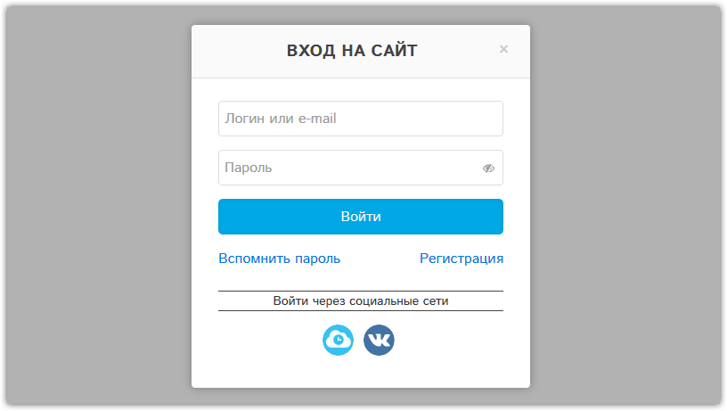

#Аякс форма авторизации и регистрации Битрикс на jQuery Ajax. Часть 3

Продолжаем совершенствовать **авторизацию сайтов на 1С Битрикс** в модальном окне **css-фреймворка Uikit** с помощью **jQuery.ajax()**  
В этой статье опишу все заново, чтобы было как можно меньше непонятных моментов и соответственно вопросов.

По Вашим многочисленным просьбам я переделал скрипт вызова модального окна, т.к. предыдущий мой вариант статьи  [Форма авторизации и регистрации Битрикс на jQuery.ajax(). Часть 2](https://tuning-soft.ru/articles/bitrix/the-authorization-form-and-registration-bitrix-jquery-ajax-part-2.html) оказался не очень гибким для многих.  

### Что нового  

1.  Теперь форму авторизации и регистрации можно вызывать хоть по разным ссылкам, хоть по одной (как было в предыдущей статье).
2.  Для входа на сайт по e-mail необходимо установить модуль из маркетплейса **Авторизация по e-mail**  

3.  Добавил переключение заголовка модального окна в зависимости от запрашиваемой формы (авторизации, регистрации, восстановления пароля).
4.  Добавил иконки авторизации через соцсети из стандартного компонента.
5.  Добавил оформление компонента восстановления пароля
6.  Переделал подключение стилей и скриптов  

7.  Изменились все почтовые шаблоны
8.  Исправлены все найденные ошибки  

## Формы авторизации

  


## Почтовые уведомления  

Вот такие будут приходить почтовые уведомления.  
Само оформление письма делает мой модуль **Умные статусы и письма заказов**, а тексты будут у вас точно такие.


  


  

### Краткая инструкция по структуре архива

Общая структура архива, в теории всю папку можно смело копировать в папку **/bitrix/**, но можно что-то покалечить, поэтому, все в ручном режиме.  

<pre>/bitrix/php_interface  
/bitrix/templates/.default  
</pre>

1\. Если у вас этот файл уже есть, тогда в самый конец вашего init.php добавьте содержимое этого файла, а если нет, просто скопируйте его.  

<pre>/bitrix/php_interface/init.php</pre>

2\. Содержимое этой папки копируйте в шаблон сайта по умолчанию .default, если там уже что-то есть, сделайте резервную копию и перезаписывайте.  

<pre>/bitrix/templates/.default</pre>

В этой папке будет две подпапки **auth** и **components  
**

<pre>/bitrix/templates/.default/auth  
/bitrix/templates/.default/components  
</pre>

Здесь все файлы авторизации (стили, скрипты, картинки, аякс-обработчик, uikit-компоненты)

<pre>/bitrix/templates/.default/auth</pre>

Здесь шаблоны компонентов авторизации Битрикс, которые формы выводят  

<pre>/bitrix/templates/.default/components</pre>

*   **system.auth.form** - форма авторизации
*   **main.register** - форма настраиваемой регистрации в файле auth.php
*   **system.auth.forgotpasswd** - форма запроса восстановления пароля
*   **system.auth.changepasswd** - форма смены пароля (не модальное)
*   **system.auth.authorize** - форма системной авторизации, где автоматом будет запускаться модальное окно авторизации  

## Инструкция по установке и настройке

1) Скачиваем архив и распаковываем в шаблоне сайта **.default** папку **auth и components**, про **php_interface** расскажу ниже, путь получится таким:  

<pre>/bitrix/templates/.default/auth  
/bitrix/templates/.default/components  
</pre>

Вот такая будет в папке **auth** структура  
  

2) Теперь будем все содержимое этой папки **auth** подключать в текущем видимом шаблоне сайта, а папку **components** трогать не будем, все шаблоны компонентов Битрикс сам будет подключать, он про это знает, поэтому я все решил для удобства хранить в дефолтном шаблоне, особенно если у вас несколько сайтов, удобно будет авторизацию из шаблона по умолчанию подключить в обоих сайтах.  
Например, у меня шаблон сайта **2014**, в этом шаблоне я буду подключать необходимые скрипты из шаблона **.default**, у вас рабочий шаблон может называться совсем иначе, например **eshop_bootstrap_blue**  

<pre>/bitrix/templates/2014</pre>

3) Все скрипты и стили подключаем в шаблоне текущего сайта в файле **header.php**

<pre>/bitrix/templates/2014/header.php  
</pre>

Подключаем именно в таком порядке, соблюдаем порядок.  

```php
<?  
//auth css  
$APPLICATION->SetAdditionalCSS("/bitrix/templates/.default/auth/css/modal.min.css");  
$APPLICATION->SetAdditionalCSS("/bitrix/templates/.default/auth/css/form.min.css");  
$APPLICATION->SetAdditionalCSS("/bitrix/templates/.default/auth/css/form.password.min.css");  
$APPLICATION->SetAdditionalCSS("/bitrix/templates/.default/auth/css/button.min.css");  
$APPLICATION->SetAdditionalCSS('/bitrix/templates/.default/auth/auth.css');  

//auth js  
$APPLICATION->AddHeadScript('/bitrix/templates/.default/auth/js/core.min.js');  
$APPLICATION->AddHeadScript('/bitrix/templates/.default/auth/js/modal.min.js');  
$APPLICATION->AddHeadScript('/bitrix/templates/.default/auth/js/form.password.min.js');  
$APPLICATION->AddHeadScript('/bitrix/templates/.default/auth/auth.js');  
?>  
```

Если вы не понимаете, есть трудности с выводом этих стилей и скриптов + сама jQuery, то вот весь необходимый код для подключения и вывода.  
Сначала подключаете и выводите стили, потом подключаете jQuery, потом остальные скрипты. jQuery всегда должна быть самой первой, это избавит вас от большинства проблем с модулями из маркетплейс.  

```php
<?  
//auth css  
$APPLICATION->SetAdditionalCSS("/bitrix/templates/.default/auth/css/modal.min.css");  
$APPLICATION->SetAdditionalCSS("/bitrix/templates/.default/auth/css/form.min.css");  
$APPLICATION->SetAdditionalCSS("/bitrix/templates/.default/auth/css/form.password.min.css");  
$APPLICATION->SetAdditionalCSS("/bitrix/templates/.default/auth/css/button.min.css");  
$APPLICATION->SetAdditionalCSS('/bitrix/templates/.default/auth/auth.css');  
//Тут выводим стили  
$APPLICATION->ShowCSS(true, false);  
?>  
<script type="text/javascript" src="<?=CUtil::GetAdditionalFileURL(SITE_TEMPLATE_PATH . '/js/jquery-1.11.2_min.js');?>"></script>  
<?  
//auth js  
$APPLICATION->AddHeadScript('/bitrix/templates/.default/auth/js/core.min.js');  
$APPLICATION->AddHeadScript('/bitrix/templates/.default/auth/js/modal.min.js');  
$APPLICATION->AddHeadScript('/bitrix/templates/.default/auth/js/form.password.min.js');  
$APPLICATION->AddHeadScript('/bitrix/templates/.default/auth/auth.js');  
//Тут выводим скрипты  
$APPLICATION->ShowHeadStrings();  
$APPLICATION->ShowHeadScripts();  
?>  
```

4) Далее разберем подробно каждый подключенный файл

На момент написания статьи версия фреймворка была **Uikit 2.27.2** + тема **gradient**  
Я специально разделил стили на файлы, чтобы тем, у кого сайт полностью сделан на Uikit, можно было отключить уже подключенные на самом сайте компоненты и стили, а у кого сайт на чем-то другом, например, готовое решение, то скорее всего надо все файлы подключить, но не факт.

Например, на моем сайте подключено всего два обязательных файла авторизации, все остальное уже в шаблоне сайта подключено.  

```php
<?  
$APPLICATION->SetAdditionalCSS('/bitrix/templates/.default/auth/auth.css');  
$APPLICATION->AddHeadScript('/bitrix/templates/.default/auth/auth.js');  
?>  
```

**  
modal.min.css** -  стили модального окна Uikit  
**form.min.css** - стили форм Uikit  
**form.password.min.css** - стили кнопки показа пароля Uikit  
**button.min.css** - стили кнопок Uikit  
**auth.css** - стили авторизации <span style="color: #ff0000;">*</span>  

**core.min.js** - основное ядро Uikit  
**modal.min.js** - скрипт модального окна Uikit  
**form.password.min.js** - скрипт показа пароля Uikit  
**auth.js** - скрипт авторизации <span style="color: #ff0000;">*</span>  

**/images** - тут иконки соцсетей и прелоадэр процесса загрузки форм

Все, вот эти все файлы должны быть подключены у кого сайт не на Uikit, у кого сайт на Uikit смотрите сами, что уже подключено, не подключайте, возможно также как у меня всего два файла подключите.  
Да, чуть не забыл, среди этих файлов компонентом Uikit является только **form.password**, все остальное уже есть в общих файлах **uikit.min.js + uikit.min.css**, т.е. если у вас подключены вот эти файлы, то модалку, формы и кнопки подключать не надо, только **form.password**

5) Далее в файле **footer.php** текущего шаблона  

<pre>/bitrix/templates/2014/footer.php</pre>

необходимо добавить верстку модального окна, в которую будут подгружаться аяксом все модалки, где-нибудь в самом конце перед закрывающим тегом </body>  

```html
<!--auth-modal-->  
<div id="auth-modal" class="uk-modal">  
    <div class="uk-modal-dialog uk-modal-dialog-slide">  
        <a class="uk-modal-close uk-close">&times;</a>  
        <div class="uk-modal-header">Вход на сайт</div>  
        <div class="uk-modal-content">  
            <div class="preloader"></div>  
        </div>  
    </div>  
</div>  
<!--//auth-modal-->  
```

6) Далее в шаблоне сайта в том же файле **header.php** вам надо где-то в нужном месте разместить одну или обе ссылки вызова окна авторизации и регистрации.  

```html
<a class="auth-link show-auth uk-margin-small-right" href="">Вход</a>  
<a class="reg-link show-auth" href="">Регистрация</a>  
```

**.auth-link** - просит аяксом у файла **auth.php** форму авторизации  
**.reg-link** - просит аяксом у файла **auth.php** форму регистрации  

По аналогии вы можете сделать вызов любой формы, достаточно дописать немного файл **auth.js  
**Все, публичная часть полностью готова!

6) Далее оформим все **почтовые шаблоны Битрикс**, приведем их к единому виду, а также добавим поле с паролем, чтобы пользователь изменив пароль получал его на почту, увы, но это так, часть людей либо не запоминает, что вводит, либо с раскладкой мучается, а так он сможет скопировать пароль и вставить, очень удобно!

Все **почтовые шаблоны** хранятся здесь:  

<pre>Настройки - Настройки продукта - Почтовые события - Почтовые шаблоны</pre>

Для поиска шаблона письма используем фильтр по полю **Тип почтового события**  


**Типы почтовых событий Битрикс для регистрации:**  
<del>**NEW_USER_CONFIRM** - Подтверждение регистрации (в статье не используется)  
</del>
<strike>**USER_INVITE** - Приглашение на сайт нового пользователя (в статье не используется)  
</strike>
**USER_INFO** - Регистрационная информация  
**NEW_USER** - Зарегистрировался новый пользователь (отправляется только админу, можно деактивировать)  
**USER_PASS_REQUEST** - Запрос на смену пароля  
**USER_PASS_CHANGED** - Подтверждение смены пароля

#### **USER_INFO:** Регистрационная информация

<pre>#LAST_NAME# #NAME#, здравствуйте!<br>  
Вы успешно зарегистрированы на сайте #SITE_NAME#<br>  
<br>  
<b>Ваши регистрационные данные:</b><br>  
Имя: #LAST_NAME# #NAME# <br>  
Логин: #EMAIL#<br>  
Пароль: #PASSWORD#<br>  
<br>  
Для смены пароля перейдите по <a href="//#SERVER_NAME#/auth/?change_password=yes&lang=ru&USER_CHECKWORD=#CHECKWORD#&USER_LOGIN=#URL_LOGIN#">ссылке</a></pre>

#### **NEW_USER:** Зарегистрировался новый пользователь

<pre>На сайте зарегистрировался новый пользователь.<br>  
<br>  
Имя: #NAME#<br>  
Логин: #LOGIN#<br>  
E-Mail: #EMAIL#<br>  
<br>  
Для управления перейдите по этой <a href="//#SERVER_NAME#/bitrix/admin/user_edit.php?lang=ru&ID=#USER_ID#">ссылке</a></pre>

#### **USER_PASS_REQUEST:** Запрос на смену пароля

<pre>#MESSAGE#<br>  
<br>  
Для смены пароля перейдите по <a href="//#SERVER_NAME#/auth/?change_password=yes&lang=ru&USER_CHECKWORD=#CHECKWORD#&USER_LOGIN=#URL_LOGIN#">ссылке</a></pre>

#### **USER_PASS_CHANGED:** Подтверждение смены пароля

<pre>#MESSAGE#<br>  
<br>  
<b>Ваши регистрационные данные:</b><br>  
Имя: #NAME# #LAST_NAME#<br>  
Логин: #LOGIN#<br>  
Эл.почта: #EMAIL#<br>  
Пароль: #PASSWORD#<br></pre>

7) Далее разберем настроки **авторизации и регистрации Битрикс**  
Сначала идем в настройки главного модуля  

<pre>Настройки - Настройки продукта - Настройки модулей - Главный модуль</pre>

Сравните свои настройки с моими, самое важное, что будет влиять на авторизацию и регистрацию, отметил красным.  


#### Настройки локальной системы авторизации

**Разрешить авторизацию через внешние сервисы** - чтобы выводилась авторизация и регистрация через соцсети необходимо включить эту настройку.

**Шаблон системных компонентов авторизации** - необходимо оставить пустым, иначе совсем другие шаблоны будут подключаться, например, **flat**, а в статье **modal**

**Передавать пароль в зашифрованном виде** - необходимо отключить, иначе аяксом будет возвращаться js-ошибка

**Позволять ли пользователям регистрироваться самостоятельно** - конечно разрешить, иначе никто не сможет зарегистрироваться на сайте  

**Запрашивать подтверждение регистрации по E-mail** - 100% отключить, чтобы разрешить автоматическую авторизацию пользователя после регистрации, иначе будет отправляться письмо с подтверждением регистрации NEW_USER_CONFIRM и море других плясок, в статье это не обсуждается.  

Тут все, остальное на вкус и цвет.

8) Далее, если нужна авторизация черз социальные сети, то необходим установленный модуль **Социальные сервисы (socialservices)**

<pre>Настройки - Настройки продукта - Модули  
</pre>

Скорее всего у вас он установлен, можете сразу переходить к настройкам соцсетей

<pre>Настройки - Настройки продукта - Настройки модулей - Социальные сервисы</pre>

Настройки соцсетей я рассматривать не буду, там есть необходимые ссылки для каждой соцсети, где, что и как сделать, единственное, вот на вкладке Авторизация у меня такие настройки  


Вроде все, попробуйте добавить соцсеть и они будут автоматически появляться в форме авторизациии.  
Тут важно знать, что не все соцсети передают на сайт e-mail, а обратный адрес для редиректа надо вручную пилить в самом компоненте авторизации через соцсети.

9) Далее, переходим к очень интересному файлу **init.php**, разберем его функционал  

<pre>/bitrix/php_interface/init.php</pre>

В этом файле нам необходимо добавить аж **четыре обработчика** событий.

#### 1) OnBeforeUserRegister - вызывается до попытки регистрации нового пользователя  

[CSS антиспам, антибот](https://tuning-soft.ru/articles/bitrix/antibot-registration-on-the-website.html) - моя фирменная фича, убийца всех капч, рекапч, антикапч, гуглокапч, недокапч, тупокапч и конечно же ботов, которые регистрируются на наших сайтах в автоматическом режиме и переполняют ее.  
Да, некоторые в это не верят, ну и зря, во все мои [Умные eCommerce решения](https://tuning-soft.ru/shop/) он по умолчанию встроен, обратите также внимание, что на моем сайте с 2013 года нет ни одной капчи, уверен, сам Тьюринг бы восхещался этим изобретением!  
Работает он просто, в форме регистрации есть скрытое невидмое человеку поле, человек его никогда не заполнит, а вот робот либо его заполнит, либо отправит форму напрямую, так вот, если в событии это поле будет заполнено, либо вообще не существовать, то это 100% бот, он не сможет зарегистрироваться на сайте.  
Для лога всех ботов в этой же папке будет создан файл **log_OnBeforeUserRegister.log**

```php
<?  
AddEventHandler("main", "OnBeforeUserRegister", "OnBeforeUserRegisterHandler");  
function OnBeforeUserRegisterHandler(&$arFields)  
{  
    global $APPLICATION;  

    //CSS ANTIBOT  
    if(!$_REQUEST['order']) {  

        if(isset($_REQUEST['ANTIBOT']) && is_array($_REQUEST['ANTIBOT'])) {  
            foreach($_REQUEST['ANTIBOT'] as $k => $v)  
                if(empty($v))  
                    unset($_REQUEST['ANTIBOT'][ $k ]);  
        }  

        if($_REQUEST['ANTIBOT'] || !isset($_REQUEST['ANTIBOT'])) {  

            //Раскомментировать для логирования при необходимости  
            //$_REQUEST['DATE'] = date('d-m-Y H:i:s');  
            //$tttfile          = dirname(__FILE__) . '/log_OnBeforeUserRegister.log';  
            //file_put_contents($tttfile, "<pre>" . print_r($_REQUEST, 1) . "</pre>\n");  

            $APPLICATION->ThrowException('Ошибка регистрации');  
            return false;  
        }  
    }  
    //\\CSS ANTIBOT  

}  
?>  
```

#### 2) OnAfterUserRegister - вызывается после попытки регистрации нового пользователя

После успешной регистрации в системе пользователь получает ID, если этот ID есть и пользователь активен:  
а) Можно создать профиль пользователя, чтобы далее при оформлении заказа он заново не вводил свои данные, это очень напрягает, получается двойная работа, а так при регистрации профиль автоматически будет создан.  
Если эта функция вам не нужна, желательно закомментируйте это условие или просто удалите, воизбежание коллизий.  

б) Необходимо отправить пользователю письмо после регистрации со всеми данными, в том числе и пароль, иначе сам Битрикс пароль не отправляет, если он вам не нужен, убирайте его из почтовых шаблонов выше.  

```php
<?  
AddEventHandler("main", "OnAfterUserRegister", "OnAfterUserRegisterHandler");  
function OnAfterUserRegisterHandler(&$arFields)  
{  
    if($USER_ID = intval($arFields['USER_ID'])) {  
        $lid = ($arFields['LID'] ? $arFields['LID'] : SITE_ID);  

        //---------- Создаем профиль покупателя после регистрации ----------//  
        if($arFields['ACTIVE'] == 'Y' && \Bitrix\Main\Loader::includeModule('sale')) {  
            //Тут коды свойств магазина, в них надо подставить соответствующие значения из формы регистрации  
            $arSaleProps = array(  
                 'LOCATION' => 1,  
                 'NAME'     => trim($arFields['NAME']),  
                 'EMAIL'    => trim($arFields['EMAIL']),  
            );  

            $arProfileFields = array(  
                 "NAME"           => $arSaleProps['EMAIL'],  
                 "USER_ID"        => $USER_ID,  
                 "PERSON_TYPE_ID" => 1,  
            );  

            //Добавит профиль покупателя без свойств  
            if($PROFILE_ID = CSaleOrderUserProps::Add($arProfileFields)) {  
                $dbUserProps = CSaleOrderUserProps::GetList(  
                     array("DATE_UPDATE" => "DESC"),  
                     array(  
                            "ID"      => $PROFILE_ID,  
                            "USER_ID" => $USER_ID,  
                     ),  
                     false,  
                     false,  
                     array("ID", "PERSON_TYPE_ID", "DATE_UPDATE")  
                );  

                //Добавит свойства в профиль  
                if($arUserProps = $dbUserProps->GetNext()) {  
                    $dbOrderProps = CSaleOrderProps::GetList(  
                         array("SORT" => "ASC", "NAME" => "ASC"),  
                         array(  
                                "PERSON_TYPE_ID" => $arUserProps["PERSON_TYPE_ID"],  
                                "USER_PROPS"     => "Y",  
                         ),  
                         false,  
                         false,  
                         array("ID", "NAME", "CODE")  
                    );  
                    while($arOrderProps = $dbOrderProps->GetNext()) {  
                        $curVal = htmlspecialcharsEx($arSaleProps[ $arOrderProps["CODE"] ]);  
                        if(isset($curVal)) {  
                            $arPropFields = array(  
                                 "USER_PROPS_ID"  => $PROFILE_ID,  
                                 "ORDER_PROPS_ID" => $arOrderProps["ID"],  
                                 "NAME"           => $arOrderProps["NAME"],  
                                 "VALUE"          => $curVal,  
                            );  
                            CSaleOrderUserPropsValue::Add($arPropFields);  
                        }  
                    }  
                }  
            }  
        }  

        //---------- Отправим письмо пользователю после регистрации со всеми данными ----------//  
        $arUserFields = array(  
             "USER_ID"   => $arFields['USER_ID'],  
             "STATUS"    => ($arFields["ACTIVE"] == "Y" ? 'Активен' : 'Не активен'),  
             "MESSAGE"   => '',  
             "LOGIN"     => $arFields["LOGIN"],  
             "PASSWORD"  => $arFields["PASSWORD"],  
             "URL_LOGIN" => urlencode($arFields["LOGIN"]),  
             "CHECKWORD" => $arFields["CHECKWORD"],  
             "NAME"      => $arFields["NAME"],  
             "LAST_NAME" => $arFields["LAST_NAME"],  
             "EMAIL"     => $arFields["EMAIL"],  
        );  

        if(!$_REQUEST['order']) {  
            CEvent::SendImmediate('USER_INFO', $lid, $arUserFields, 'N');  
        }  

        //Если отправить стандартную информацию пользователю, но без пароля,  
        //тогда отправку выше CEvent::SendImmediate() надо закомментить, а эту раскомментить  
        //CUser::SendUserInfo($USER->GetID(), SITE_ID, 'Вы успешно зарегистрированы.', true);  
    }  
}  
?>
```

#### 3) OnSendUserInfo - дает возможность переопределения параметров отправки почтового события USER_INFO

Данное событие нужно для подстановки пароля в почтовые шаблоны  
```php
<?  
AddEventHandler("main", "OnSendUserInfo", "OnSendUserInfoHandler");  
function OnSendUserInfoHandler(&$arParams)  
{  
    //---------- Подставим пароль в поля почтового шаблона ----------//  
    $bPassword = ($_REQUEST['USER_PASSWORD'] && $_REQUEST['USER_PASSWORD'] == $_REQUEST['USER_CONFIRM_PASSWORD']);  

    if(!$bPassword && $_SESSION['SESS_AUTH']['CONFIRM_PASSWORD']) {  
        $bPassword                 = true;  
        $_REQUEST['USER_PASSWORD'] = $_SESSION['SESS_AUTH']['CONFIRM_PASSWORD'];  
    }  

    if($arParams['FIELDS'] && $bPassword) {  
        $arParams['FIELDS']['PASSWORD'] = $_REQUEST['USER_PASSWORD'];  
    }  
}  
?>
```


#### 4) OnAfterUserAdd - дает возможность получить и записать пароль в сессию для метода OnSendUserInfoHandler

```php
<?  
AddEventHandler("main", "OnAfterUserAdd", "OnAfterUserAddHandler");  
function OnAfterUserAddHandler(&$arFields)  
{  
    //---------- Подставим пароль в сессию для метода OnSendUserInfoHandler ----------//  
    if($_SESSION['SESS_AUTH'])  
        $_SESSION['SESS_AUTH']['CONFIRM_PASSWORD'] = $arFields['CONFIRM_PASSWORD'];  
}  
?>
```

Пока на этом все, все обновленные файлы я прикрепил, надеюсь статья вам поможет в этом нелегком деле!

### Дополнительно по просьбам трудящихся

**1) Как сделать переключение ссылок авторизации на личный кабинет, когда пользователь вошел на сайт?  
**В хедере **(header.php)** шаблона сайта добавьте такое условие  

```php
<div class="uk-display-inline-block uk-text-left">  
   <? if($USER->IsAuthorized()): ?>  
      <div class="uk-button-group">  
         <a href="/personal/" class="uk-button"><?=$USER->GetFormattedName();?></a>  
         <div data-uk-dropdown="{mode:'click',pos:'top-right'}">  
            <button class="uk-button"><i class="uk-icon-caret-down"></i></button>  
            <div class="uk-dropdown uk-dropdown-small">  
               <ul class="uk-nav uk-nav-dropdown">  
                  <li><a href="/personal/orders/?filter_history=Y"><i class="uk-icon-shopping-cart uk-margin-small-right"></i>История заказов</a></li>  
                  <li><a href="/personal/profiles/"><i class="uk-icon-user uk-margin-small-right"></i>Мои профили</a></li>  
                  <li><a href="/personal/subscribe/"><i class="uk-icon-envelope uk-margin-small-right"></i>Рассылки</a></li>  
                  <li><a href="/personal/support/"><i class="uk-icon-bug uk-margin-small-right"></i>Техподдержка</a></li>  
                  <li class="uk-nav-divider"></li>  
                  <li><a href="?logout=yes"><i class="uk-icon-sign-out uk-margin-small-right"></i>Выйти</a></li>  
               </ul>  
            </div>  
         </div>  
      </div>  
   <? else: ?>  
      <div class="uk-text-center">  
         <a class="auth-link show-auth uk-margin-small-right" href="">Вход</a>  
         <a class="reg-link show-auth" href="">Регистрация</a>  
      </div>  
   <? endif; ?>  
</div>
```

**2) Как можно реализовать появление модального окна, если пользователь заходит по прямой ссылке, например на страницу личного кабинета?**

а) В архиве есть шаблон **.default** компонента **system.auth.authorize**, в нем сделал пример, когда можно открыть форму по кнопке, этот шаблон будет применяться ко всем формам системной авторизации, если не нужен, обязательно удалите этот шаблон полностью.

б) Чтобы автоматически окно появлялось, добавил в этом же шаблоне скрипт, если пользователь открывает страницу с этим скриптом, на какой-бы странице он его не открыл, форма авторизации на всех страницах существует, скрипт откроет форму по событию **click** по кнопке/ссылке.  
Если кнопку нужно будет убрать, а запуск окна оставить, то спрячте кнопку с помощью **style="display:none"**  

```html
<button class="auth-link uk-button uk-button-primary uk-button-large">Вход / Регистрация</button>  
<script type="text/javascript">  
    $(function () {  

        setTimeout(function(){  
            $('.auth-link').trigger('click');  
        },1000)  

    });  
</script>
```

**3) Как сделать, чтоб пользователь мог вводить только пароль и имейл при регистрации, вместо логина?**

В файле `auth.php` для компонента `bitrix:main.register`  укажите эти значения:

```php
"SHOW_FIELDS" => array("EMAIL", "PASSWORD", "CONFIRM_PASSWORD"),  
"REQUIRED_FIELDS" => array("EMAIL", "PASSWORD", "CONFIRM_PASSWORD"),  
```

Чуть выше найдите вот эту строчку и закомментируйте, чтобы автоматический пароль не заменял пароль введенный пользователем

```php
//$_REQUEST["REGISTER"]["PASSWORD"] = $_REQUEST["REGISTER"]["CONFIRM_PASSWORD"] = randString($password_min_length, $password_chars);
```

**UPD: 11/03/2017**

*   **Изменены события в init.php**  
    а) Убрал обработкустраницы оформления заказа, чтобы не блокировал регистрацию и не присылал дубли писем, в условиях есть два  `!$_REQUEST['order']`  
    б) Добавил событие `OnAfterUserAdd` для подстановки пароля в письмо, например, при автоматической регистрации при оформлении заказа, когда пароль генерируется тем компонентом, а не авторизацией.  

*   **Перезалил шаблон компоннета system.auth.forgotpasswd**  
    Вместо поля USER_LOGIN лучше подставить USER_EMAIL, чтобы работало восстановление пароля по email
*   **Изменены почтовые шаблоны, вроде все, это не зафиксировал.**
*   Больше ничего не изменялось, перезалил архив v3.2  

Скачать файлы авторизации Битрикс: [ajax-auth-register-send-password-3.2.zip](/upload/articles/files/ajax-auth-register-send-password-3.2.zip)  
